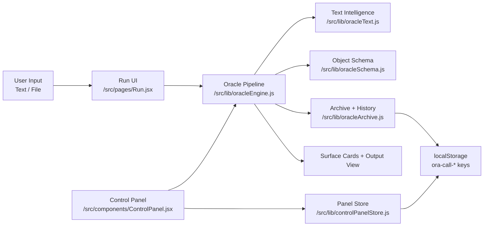
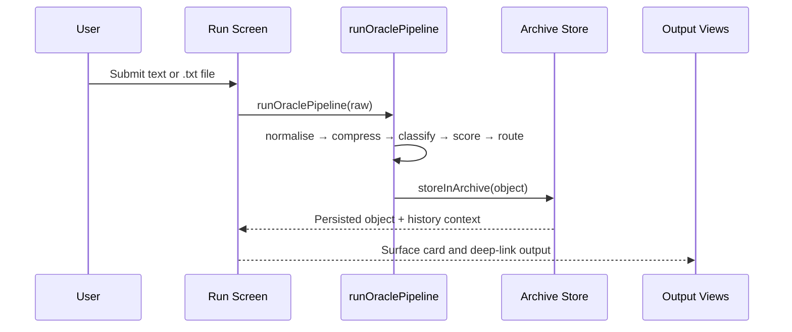

# ORA-CALL

ORA-CALL is a focused React + Vite app for transforming raw input into structured Oracle outputs, reviewing decisions, and tracking operational drafts.

## App Profile

### Core Value
- Turn unstructured input into usable output through a visible pipeline.
- Keep decisions auditable with archive history, routing signals, and control-panel logs.
- Maintain a sharp Oracle-branded interface with lightweight navigation.

### User Surfaces
| Surface | Route | Purpose |
|---|---|---|
| Entry | `/` | Landing and flow entry point |
| Run | `/run` | Input capture, pipeline execution, and output surfacing |
| Home | `/home` | Oracle home context |
| Missions | `/missions` | Mission-oriented view |
| Control Panel | `/panel` | Draft generation, approval workflow, and logs |
| Output Detail | `/output/:id` | Direct inspection of a specific output |

## Architecture at a Glance

## Repository Structure

| Path | Role |
|---|---|
| `src/` | React app (pages, components, styling, pipeline libs) |
| `oracle/docs/` | System-level direction, standards, architecture |
| `oracle/mia/` | Agent identity, rules, prompts, mission framework |
| `oracle_agent_api/` | Backend API scaffold |
| `oracle_workspace/` | Workspace state buckets (`drafts/approved/rejected/logs`) |
| `canon/` | Historical canon material |

## Local Development

From `/tmp/workspace/second-shot/ORACLE-V5`:

1. `npm ci`
2. `npm run dev`
3. `npm run build`
4. `npm run preview`

## Design Intent

The project standard is simple: minimal noise, explicit structure, and visible operational flow.
