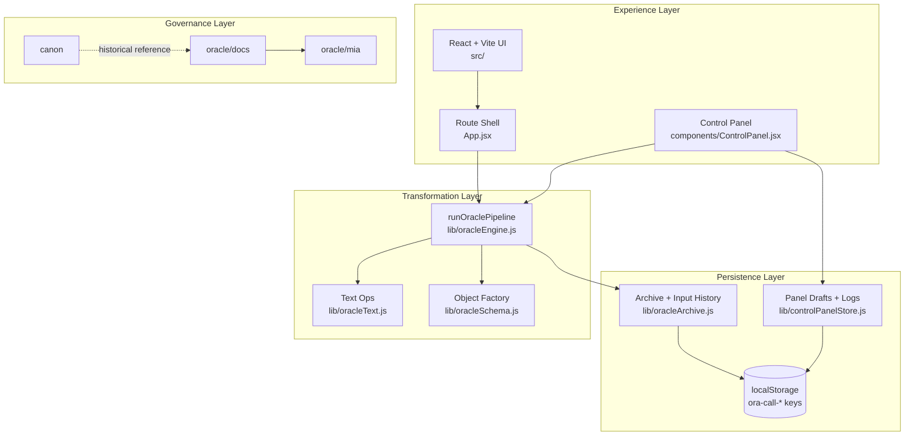

# Oracle Architecture

## Purpose
This document defines the current Oracle V5 architecture, its runtime boundaries, and how system docs and app execution stay aligned.

*Last audited: 2026-05-25*

---

## 1) System Topology

---

## 2) Runtime Flow

Pipeline state is stamped per stage (`captured` → `surfaced`) and attached to `pipelineLog` for traceability.

---

## 3) Route Map

| Route | Module | Responsibility |
|---|---|---|
| `/` | `src/pages/Entry.jsx` | Entry point |
| `/run` | `src/pages/Run.jsx` | Input intake, pipeline execution, object surfacing |
| `/home` | `src/pages/Home.jsx` | Oracle home view |
| `/missions` | `src/pages/Missions.jsx` | Mission board surface |
| `/panel` | `src/components/ControlPanel.jsx` | Draft generation, decisioning, logs |
| `/output/:id` | `src/pages/OutputPage.jsx` | Detailed object inspection |

---

## 4) Storage Model

- **Archive data**: managed in `oracleArchive.js`.
- **Control panel state**: managed in `controlPanelStore.js`.
- **Persistence substrate**: browser `localStorage` with `ora-call-*` keys and migration from legacy key names.

This keeps state local-first and lightweight while preserving session continuity.

---

## 5) Documentation Boundaries

### `oracle/docs/`
System-level truth: architecture, standards, workflows, memory, and roadmap context.

### `oracle/mia/`
Agent-level operational system: profile, rules, prompts, mission process, and reports.

### `canon/`
Historical canon context retained for continuity; it is reference material, not the current operating layer.

---

## 6) Architectural Principles

1. **Visible transformation**: every meaningful pipeline stage is explicit.
2. **Lightweight persistence**: local-first storage with predictable keying.
3. **Clear boundaries**: UI execution, transformation logic, persistence, and governance are separated.
4. **Operational readability**: route map and state model stay understandable at a glance.

---

## Current Objective
Keep the system polished and low-noise while improving operational depth: stronger pipeline observability, sharper mission execution loops, and cleaner governance wiring across docs and runtime behavior.
